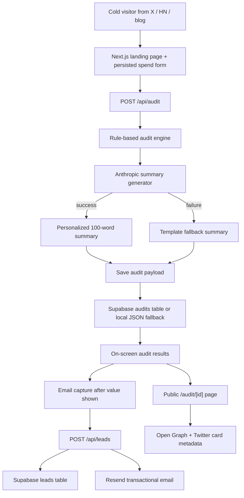

# Architecture

## Data Flow

The user enters team size, primary use case, and paid AI tools. Form state is saved in `localStorage` on every change so reloads do not lose work. On submit, the client posts only the audit inputs to `/api/audit`.

The server runs `runAudit`, which compares each tool against pricing constants and usage-fit rules. It calculates current spend, recommended spend, monthly savings, annual savings, and a verdict. The server then asks Anthropic for a short summary; if the API key is missing or the call fails, the app returns a deterministic fallback summary. The final audit is stored under a short unique id and returned to the browser.

The user sees value before any email gate. If they want the report, they submit email plus optional company, role, and team size. The public report strips identifying lead details and renders from the saved audit payload at `/audit/[id]`.

## Stack Choice

Next.js is the right fit because this app needs both a rich client form and server-rendered public result pages with dynamic Open Graph metadata. TypeScript keeps pricing rules, plans, and audit outputs explicit. Tailwind CSS v4 is used for styling because it keeps the MVP fast to iterate while avoiding a prebuilt admin template or component library.

Supabase is used as the production backend because it provides Postgres durability without custom infrastructure. Resend is used for transactional email because its API is simple and works well from serverless functions. Anthropic is used only for the personalized paragraph, not for audit math.

## Scaling to 10k Audits per Day

At 10k audits/day I would remove the local JSON fallback, require Supabase or managed Postgres, add database indexes on `created_at` and `audit_id`, move email sending into a queue, and add a durable rate limiter backed by Redis or Upstash. I would cache pricing rules by version and store the pricing version with every audit so older reports remain explainable. I would also add analytics events for form start, audit completion, lead capture, share clicks, and Credex consultation clicks.
