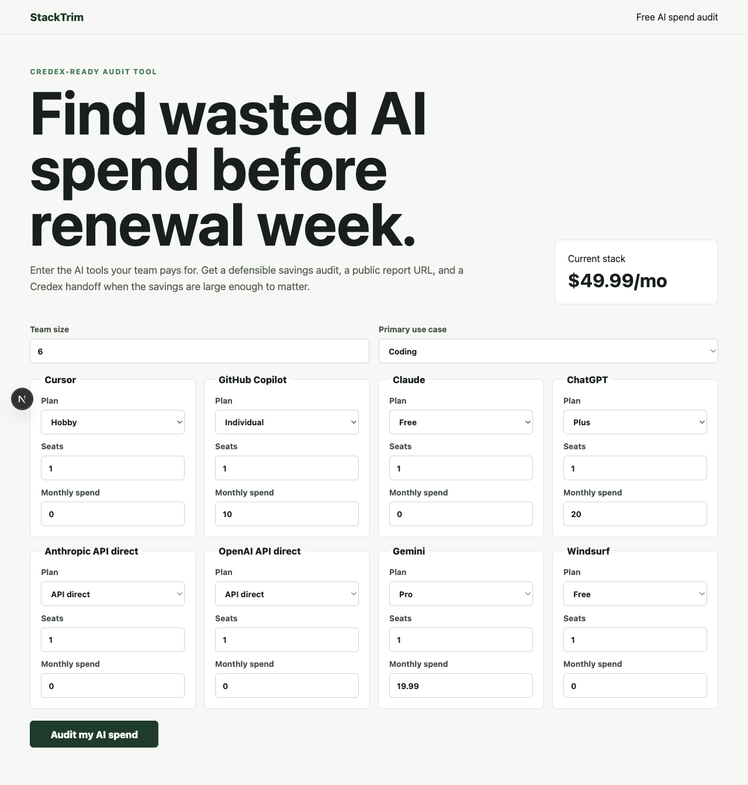
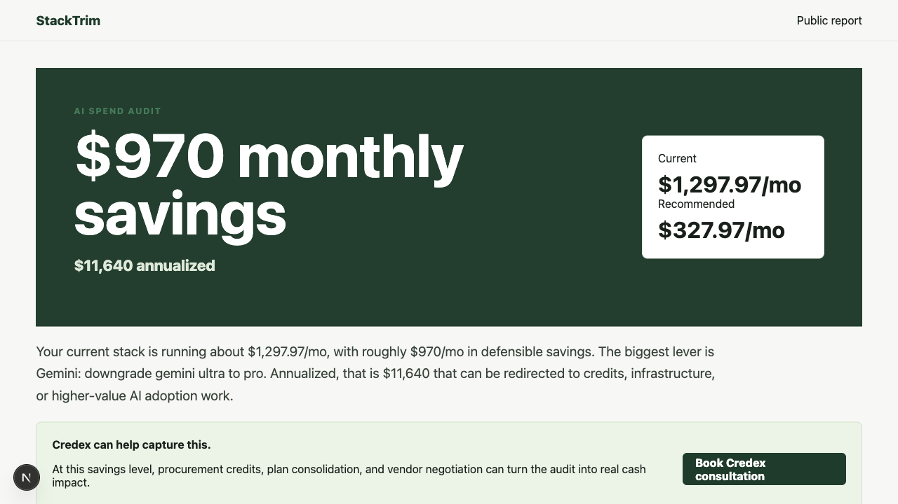
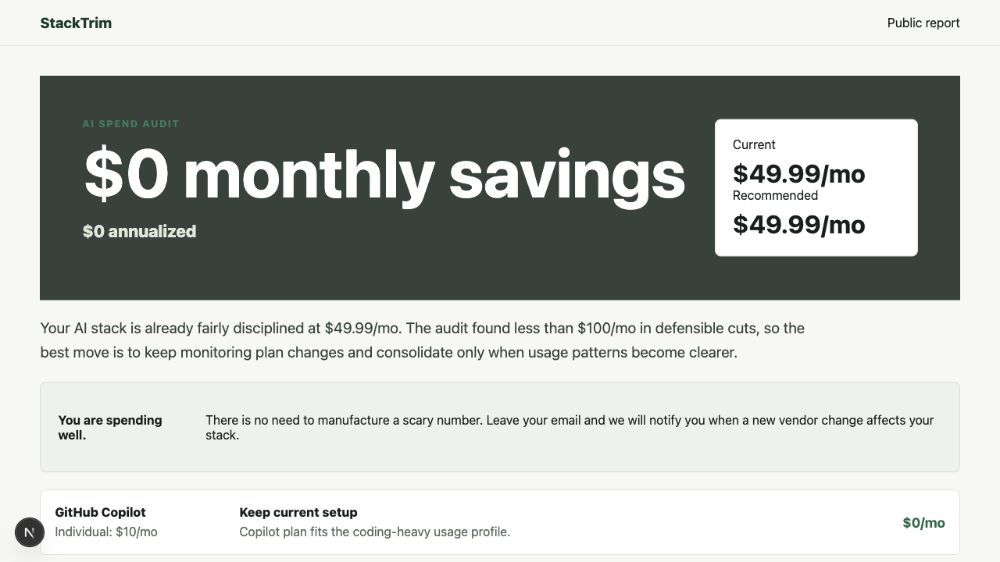

# StackTrim

StackTrim is a free AI spend audit tool for founders, finance leads, and engineering managers who want to cut waste across AI subscriptions, coding agents, and direct API usage before renewal season. Users enter their current tools and seats, receive an instant rule-based savings report, then can capture the report by email or share a public audit URL.

Deployed URL: pending deployment.

## Screenshots

Local smoke-test screenshots:

- 
- 
- 

## Quick Start

```bash
npm install
npm run dev
npm test
npm run build
```

Set these environment variables in production:

```bash
NEXT_PUBLIC_APP_URL=https://your-domain.example
ANTHROPIC_API_KEY=sk-ant-...
ANTHROPIC_MODEL=claude-sonnet-4-5
SUPABASE_URL=https://...
SUPABASE_SERVICE_ROLE_KEY=...
RESEND_API_KEY=re_...
RESEND_FROM_EMAIL="StackTrim <audits@your-domain.example>"
```

Supabase tables:

```sql
create table audits (
  id text primary key,
  payload jsonb not null,
  created_at timestamptz default now()
);

create table leads (
  id bigint generated always as identity primary key,
  audit_id text references audits(id),
  email text not null,
  company text,
  role text,
  team_size int,
  created_at timestamptz default now()
);
```

Deploy on Vercel or Netlify as a standard Next.js app. Add the environment variables above, connect Supabase and Resend, then run the CI workflow on `main`.

## Decisions

1. Used Next.js App Router because public audit URLs need server-rendered Open Graph metadata while the form benefits from client-side persistence.
2. Kept the audit engine deterministic and testable. The LLM only writes the short summary, because finance math should be explainable.
3. Chose Supabase REST instead of adding a database client dependency. It keeps the MVP small and works on serverless deployments.
4. Added a local JSON fallback for audits so the app can be tested without production credentials, but production should use Supabase.
5. Moved the UI to Tailwind CSS v4 utilities with `@tailwindcss/postcss`, keeping only the Tailwind import in global CSS.
6. Used a honeypot plus lightweight in-memory rate limit for lead capture. It is low-friction for a free tool and enough for MVP abuse protection.
7. Kept pricing constants in one file with official sources in `PRICING_DATA.md` so every audit rule can be reviewed.

## Current Status

The app builds and the audit engine tests pass locally. Deployment, real screenshots, real user interviews, and multi-day git history still need to be completed honestly over the actual evaluation window.
